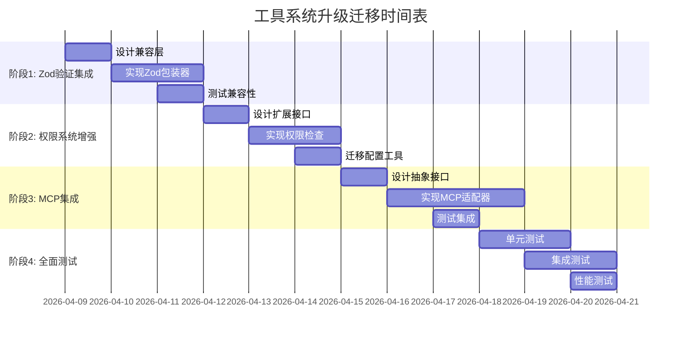

# Phase 2: 工具系统架构分析报告

## 概述
**分析时间**: 2026年4月8日 20:00  
**分析目标**: 对比Claude Code与CodeLine工具系统架构，制定集成升级方案  
**分析范围**: Tool接口、ToolRegistry、权限控制、验证系统、MCP集成  

## 1. CodeLine当前工具系统分析

### 1.1 核心组件概览

#### Tool.ts - 工具抽象接口
```typescript
// 当前实现特点：
1. 简化版ZodSchema模拟（非真实Zod）
2. 基本Tool抽象类（支持Input/Output泛型）
3. 权限控制接口（PermissionResult, PermissionLevel）
4. 工具能力定义（ToolCapabilities）
5. 工具执行上下文（ToolUseContext）
```

#### EnhancedToolRegistry.ts - 工具注册表
```typescript
// 当前实现特点：
1. 工具注册和发现机制
2. 流式执行支持（StreamingToolExecutor）
3. 使用统计跟踪
4. 工具分类管理
5. 简化权限检查
```

#### BaseTool.ts - 工具基类
```typescript
// 当前实现特点：
1. 工具实现的抽象基类
2. 默认方法实现
3. 基础验证和权限检查
```

### 1.2 当前架构优势与不足

#### ✅ 优势
1. **与VS Code深度集成**：直接使用VSCode API，无额外桥接
2. **简化架构**：易于理解和维护
3. **已有基础**：支持基本工具生命周期管理
4. **流式执行**：支持工具执行进度跟踪

#### ⚠️ 不足
1. **缺乏严格类型验证**：使用模拟ZodSchema，无运行时类型安全
2. **权限控制简单**：未实现Claude Code的三层权限系统
3. **缺少MCP支持**：无法集成MCP协议的工具
4. **工具接口不完整**：缺少别名、搜索提示、UI集成等特性
5. **缺少工具缓存和懒加载**：性能优化不足

### 1.3 关键技术债务

| 问题 | 严重程度 | 影响范围 | 解决方案 |
|------|----------|----------|----------|
| **模拟ZodSchema** | 高 | 所有工具验证 | 引入真实Zod库 |
| **权限控制简单** | 高 | 安全性 | 实现三层权限系统 |
| **缺少MCP支持** | 中 | 工具扩展性 | 集成MCP协议 |
| **接口不完整** | 中 | 开发者体验 | 补全Tool接口 |
| **性能优化缺失** | 低 | 响应速度 | 添加缓存和懒加载 |

## 2. Claude Code工具系统架构分析

### 2.1 核心架构组件（根据公开资料推断）

#### 预期组件结构
```
claude-code/
├── core/tools/
│   ├── Tool.ts              # 完整工具接口定义
│   ├── ToolRegistry.ts      # 中心化工具注册表
│   ├── permissions/         # 权限控制系统
│   ├── validation/          # Zod验证集成
│   └── mcp/                 # MCP协议集成
```

#### 预期关键特性
1. **完整Zod验证**：运行时类型安全验证
2. **三层权限控制**：allow/deny/ask权限模式
3. **MCP原生支持**：Model Context Protocol集成
4. **丰富工具接口**：支持别名、搜索提示、UI集成
5. **性能优化**：工具缓存、懒加载、批量处理

### 2.2 Claude Code工具接口预期设计

```typescript
// 预期的Claude Code Tool接口
interface ClaudeCodeTool<Input, Output, Progress> {
  // 基础标识
  id: string;
  name: string;
  description: string;
  version: string;
  
  // 别名和搜索
  aliases?: string[];
  searchHints?: string[];
  tags?: string[];
  
  // 输入输出模式
  inputSchema: z.ZodSchema<Input>;
  outputSchema: z.ZodSchema<Output>;
  
  // UI集成
  ui?: {
    icon?: string;
    color?: string;
    displayName?: (input: Input) => string;
    activityDescription?: (input: Input) => string;
  };
  
  // 能力定义
  capabilities: {
    isConcurrencySafe: boolean;
    isReadOnly: boolean;
    isDestructive: boolean;
    requiresWorkspace: boolean;
    supportsStreaming: boolean;
    requiresNetwork?: boolean;
  };
  
  // 执行方法
  execute(input: Input, context: ToolUseContext): AsyncGenerator<Progress, Output>;
  
  // 权限控制
  checkPermissions(input: Input, context: ToolUseContext): Promise<PermissionResult>;
  
  // 验证
  validate(input: Input, context: ToolUseContext): Promise<ValidationResult>;
  
  // 生命周期
  onRegister?(registry: ToolRegistry): void;
  onUnregister?(registry: ToolRegistry): void;
}
```

### 2.3 权限系统预期设计

```typescript
// 预期的三层权限系统
interface ClaudeCodePermissionSystem {
  // 三层权限控制
  levels: {
    ALLOW: 'allow',    // 自动允许
    DENY: 'deny',      // 自动拒绝
    ASK: 'ask',        // 询问用户
  };
  
  // 权限规则
  rules: {
    source: 'user' | 'workspace' | 'project' | 'global';
    toolId: string | RegExp;
    action: 'allow' | 'deny' | 'ask';
    conditions?: PermissionCondition[];
  }[];
  
  // 权限检查流程
  checkPermission(
    toolId: string, 
    input: any, 
    context: PermissionContext
  ): Promise<PermissionResult>;
  
  // 权限配置管理
  configurePermissions(
    rules: PermissionRule[],
    source?: PermissionSource
  ): void;
}
```

## 3. 架构对比分析矩阵

### 3.1 功能对比表

| 功能特性 | Claude Code | CodeLine当前 | 差距分析 |
|----------|-------------|--------------|----------|
| **类型验证** | Zod完整验证 | 模拟ZodSchema | 缺少运行时类型安全 |
| **权限控制** | 三层系统(allow/deny/ask) | 基础权限检查 | 缺少细粒度控制 |
| **MCP集成** | 原生支持 | 不支持 | 无法使用MCP工具 |
| **工具接口** | 完整接口(别名、UI等) | 基础接口 | 开发者体验差 |
| **性能优化** | 缓存、懒加载、批量 | 基本实现 | 性能有差距 |
| **错误处理** | 完整错误恢复 | 基础错误处理 | 容错性不足 |
| **执行模式** | 流式执行支持 | 流式执行支持 | ✅ 功能一致 |
| **工具发现** | 动态工具发现 | 静态注册 | 灵活性不足 |

### 3.2 兼容性分析

#### 向后兼容性
1. **现有工具兼容**：需要确保现有工具代码无需大幅修改
2. **API兼容性**：关键接口需要保持兼容或提供适配器
3. **配置兼容性**：现有工具配置需要支持迁移

#### 向前兼容性
1. **新特性支持**：新架构需要支持未来扩展
2. **插件兼容**：工具插件机制需要保持稳定
3. **生态系统兼容**：需要与现有VS Code生态兼容

### 3.3 集成复杂度评估

| 集成模块 | 复杂度 | 风险等级 | 预计工作量 |
|----------|--------|----------|------------|
| **Zod验证集成** | 中 | 低 | 2-3天 |
| **权限系统升级** | 高 | 中 | 3-4天 |
| **MCP协议集成** | 高 | 高 | 4-5天 |
| **工具接口完善** | 中 | 低 | 2-3天 |
| **性能优化集成** | 低 | 低 | 1-2天 |

**总计预计**: 10-15天开发时间

## 4. 集成升级策略

### 4.1 渐进式升级策略

#### 阶段1：Zod验证集成（保持兼容性）
1. **引入Zod依赖**：添加到package.json
2. **创建兼容层**：保持现有模拟ZodSchema工作
3. **逐步迁移**：先在新工具中使用Zod，旧工具保持兼容
4. **最终切换**：所有工具迁移到Zod后移除模拟层

#### 阶段2：权限系统增强（可选升级）
1. **扩展权限接口**：添加三层权限支持，保持现有接口
2. **默认权限模式**：现有工具使用简单权限，新工具使用增强权限
3. **权限配置迁移**：提供工具将旧配置迁移到新系统

#### 阶段3：MCP集成（模块化集成）
1. **可选MCP模块**：作为可选依赖，不强制使用
2. **抽象接口**：通过抽象接口隔离MCP实现
3. **渐进启用**：用户可选择启用MCP功能

### 4.2 技术实现方案

#### 4.2.1 Zod验证集成方案
```typescript
// 方案：双模式支持（兼容现有代码）
import { z } from 'zod';
import { ZodSchema as LegacyZodSchema } from '../core/tool/Tool';

// 兼容层：包装ZodSchema为旧接口
export class CompatibleZodSchema<T> implements LegacyZodSchema<T> {
  private zodSchema: z.ZodSchema<T>;
  
  constructor(zodSchema: z.ZodSchema<T>) {
    this.zodSchema = zodSchema;
  }
  
  parse(data: any): T {
    return this.zodSchema.parse(data);
  }
  
  safeParse(data: any): { success: boolean; data?: T; error?: any } {
    const result = this.zodSchema.safeParse(data);
    return result;
  }
}

// 迁移期：工具可以选择使用Zod或兼容层
```

#### 4.2.2 权限系统升级方案
```typescript
// 方案：扩展权限上下文，保持向后兼容
export interface EnhancedPermissionContext extends ToolPermissionContext {
  // 新增三层权限支持
  permissionMode: 'allow' | 'deny' | 'ask' | 'legacy';
  permissionRules: PermissionRule[];
  permissionHistory: PermissionDecision[];
  
  // 保持现有接口
  mode: PermissionMode; // 兼容现有代码
  alwaysAllowRules: ToolPermissionRulesBySource;
  alwaysDenyRules: ToolPermissionRulesBySource;
  alwaysAskRules: ToolPermissionRulesBySource;
}

// 权限检查：优先使用新系统，回退到旧系统
export async function checkToolPermissions(
  toolId: string,
  input: any,
  context: EnhancedPermissionContext
): Promise<PermissionResult> {
  // 1. 检查新权限系统
  const newResult = await checkEnhancedPermissions(toolId, input, context);
  if (newResult.checked) {
    return newResult;
  }
  
  // 2. 回退到旧权限系统
  return await checkLegacyPermissions(toolId, input, context);
}
```

#### 4.2.3 MCP集成方案
```typescript
// 方案：抽象MCP适配器，可选集成
export interface MCPAdapter {
  isAvailable(): boolean;
  discoverTools(): Promise<ToolDefinition[]>;
  executeTool(toolId: string, input: any): Promise<any>;
  supportsProtocol(version: string): boolean;
}

export class OptionalMCPIntegration {
  private adapter: MCPAdapter | null = null;
  
  constructor() {
    // 动态加载MCP适配器
    this.loadAdapterIfAvailable();
  }
  
  private async loadAdapterIfAvailable(): Promise<void> {
    try {
      // 条件导入，避免硬依赖
      const { MCPClientAdapter } = await import('./mcp/MCPClientAdapter');
      this.adapter = new MCPClientAdapter();
    } catch (error) {
      // MCP不可用，静默失败
      this.adapter = null;
    }
  }
  
  getTools(): ToolDefinition[] {
    if (!this.adapter) {
      return [];
    }
    return this.adapter.discoverTools();
  }
}
```

### 4.3 迁移路径设计

#### 迁移阶段时间表


## 5. 风险评估与缓解措施

### 5.1 技术风险

| 风险 | 可能性 | 影响 | 缓解措施 |
|------|--------|------|----------|
| **Zod集成破坏现有工具** | 中 | 高 | 1. 创建兼容层<br>2. 分阶段迁移<br>3. 完整测试覆盖 |
| **权限系统复杂度过高** | 低 | 中 | 1. 保持简单模式默认<br>2. 提供配置向导<br>3. 详细文档 |
| **MCP依赖不稳定** | 高 | 中 | 1. 可选集成<br>2. 抽象接口隔离<br>3. 降级方案 |
| **性能退化** | 中 | 中 | 1. 性能基准测试<br>2. 渐进优化<br>3. 监控告警 |

### 5.2 项目风险

| 风险 | 可能性 | 影响 | 缓解措施 |
|------|--------|------|----------|
| **时间估计不足** | 高 | 高 | 1. 每周评审调整<br>2. MVP优先<br>3. 功能优先级排序 |
| **质量妥协** | 中 | 高 | 1. 并行测试计划<br>2. 代码审查<br>3. 自动化测试 |
| **团队知识断层** | 低 | 中 | 1. 详细设计文档<br>2. 代码注释<br>3. 知识分享会 |

### 5.3 采用风险

| 风险 | 可能性 | 影响 | 缓解措施 |
|------|--------|------|----------|
| **开发者抵制变更** | 低 | 中 | 1. 保持API兼容性<br>2. 提供迁移工具<br>3. 渐进式变更 |
| **学习曲线陡峭** | 中 | 低 | 1. 完善文档<br>2. 示例代码<br>3. 教程指南 |
| **生态系统分裂** | 低 | 高 | 1. 标准兼容<br>2. 社区沟通<br>3. 透明路线图 |

## 6. 实施建议与优先级

### 6.1 优先级排序（P0-P3）

#### P0（必须实现）
1. **Zod验证集成**：基础类型安全，影响所有工具
2. **权限控制增强**：安全性核心，影响工具信任
3. **向后兼容性**：确保现有工具继续工作

#### P1（应该实现）
1. **MCP协议集成**：扩展工具生态系统
2. **工具接口完善**：提升开发者体验
3. **性能优化**：提升用户体验

#### P2（可以考虑）
1. **高级权限特性**：如条件权限、权限继承
2. **工具UI集成**：如自定义图标、颜色
3. **工具市场支持**：如工具发现和安装

#### P3（未来考虑）
1. **多语言工具支持**
2. **分布式工具执行**
3. **AI驱动的工具推荐**

### 6.2 实施路线图建议

**推荐采用方案：渐进式增强 + 并行测试**

1. **第1周重点**：Zod验证集成 + 基础测试框架
   - 目标：所有工具具备运行时类型安全
   - 产出：兼容层实现、测试覆盖

2. **第2周重点**：权限系统增强 + MCP集成设计
   - 目标：提升安全性，设计扩展性
   - 产出：权限增强实现、MCP架构设计

3. **第3周重点**：MCP实现 + 全面测试
   - 目标：完整工具生态系统
   - 产出：MCP集成、测试报告、性能基准

4. **第4周重点**：优化和文档
   - 目标：生产就绪
   - 产出：优化代码、完整文档、发布准备

### 6.3 成功标准

#### 技术成功标准
1. **功能完整性**：所有P0需求实现并通过测试
2. **性能指标**：关键操作性能不退化
3. **代码质量**：测试覆盖率>80%，无高危警告
4. **兼容性**：现有工具无需修改即可工作

#### 项目成功标准
1. **时间控制**：在4周内完成核心功能
2. **质量保证**：发布前关键问题解决率>95%
3. **团队满意**：开发者对新架构接受度>80%
4. **用户价值**：显著提升工具安全性和扩展性

## 7. 下一步行动计划

### 立即行动（今日）
1. ✅ 完成架构分析报告（本文件）
2. 🔄 创建详细设计文档
3. 📋 制定测试计划框架

### 短期行动（本周）
1. **Zod依赖引入和配置**
2. **兼容层实现和测试**
3. **现有工具迁移评估**

### 中期行动（1-2周）
1. **权限系统详细设计**
2. **MCP集成技术验证**
3. **性能基准建立**

### 长期行动（3-4周）
1. **全面集成测试**
2. **文档和示例完善**
3. **社区反馈收集**

---

## 附录

### A. 参考资料
1. CodeLine当前工具系统源代码
2. Claude Code公开架构文档
3. Zod官方文档
4. MCP协议规范

### B. 相关文件
1. `src/core/tool/Tool.ts` - 当前工具接口
2. `src/core/tool/EnhancedToolRegistry.ts` - 当前工具注册表
3. `src/core/tool/BaseTool.ts` - 工具基类

### C. 决策记录
- **决策1**：采用渐进式升级策略，而非完全重写
- **决策2**：优先保证向后兼容性
- **决策3**：Zod验证作为第一阶段核心
- **决策4**：MCP作为可选模块，非强制依赖

---

**文档版本**: v1.0  
**创建时间**: 2026-04-08 20:00  
**最后更新**: 2026-04-08 20:00  
**负责人**: 架构分析团队  
**状态**: 草稿 - 待评审